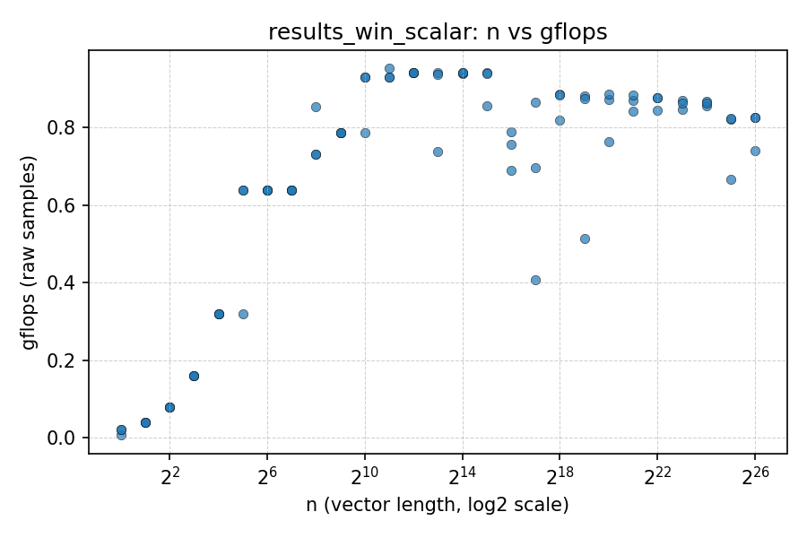
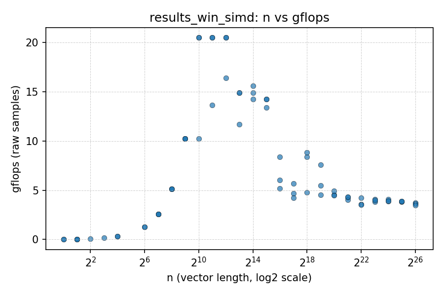
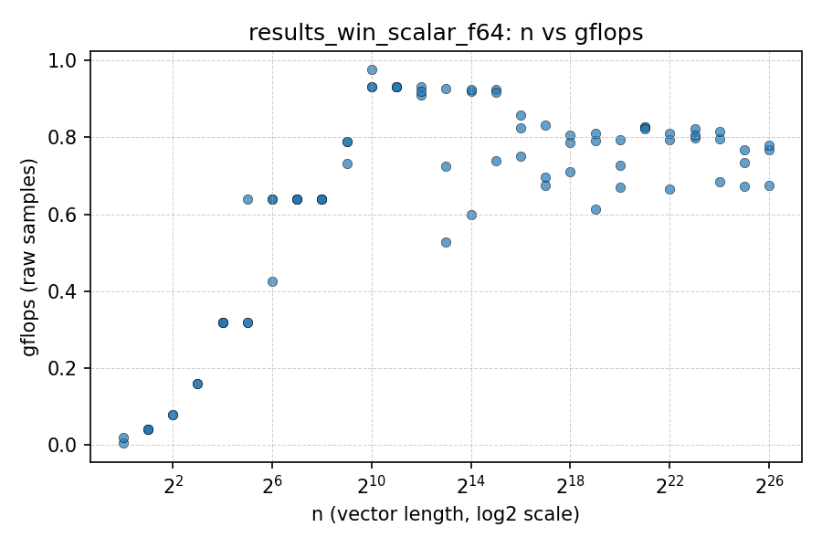
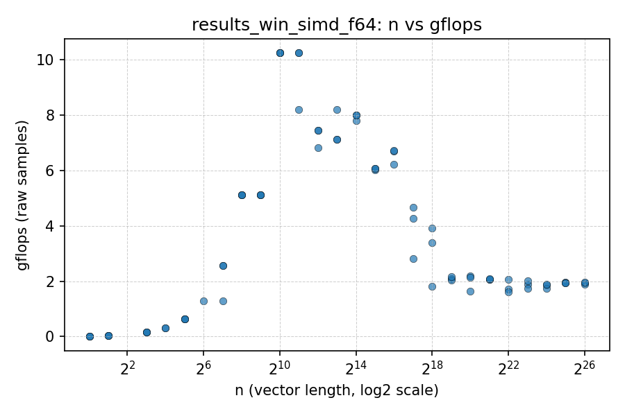
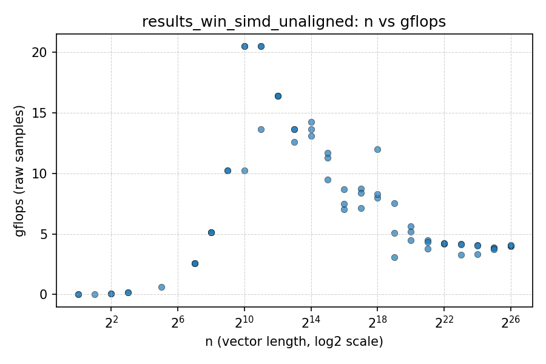
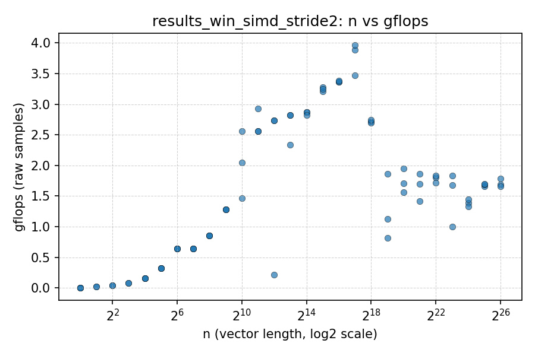
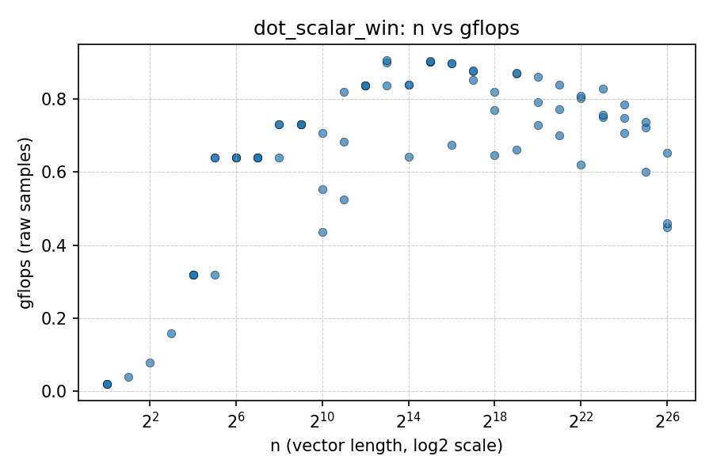
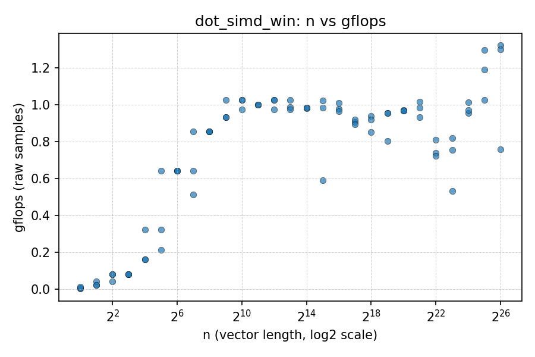

# ECSE-4320 Project 1 Lab Report

## Basline (scalar) vs auto-vectorized
My compilation flag for the baseline version was
```bash
g++ -O0 -fno-tree-vectorize kernel.cpp -o kernel.exe
```
For the auto-vectorized version, I used
```bash
g++ -O3 -mavx2 kernel.cpp -o kernel.exe
```

The `-OX` flag enables optimization at various levels from 0 to 3. `-fno-tree-vectorize` disables auto-vectorization, which is enabled by default. `-mavx2` enables the use of AVX2 instructions for vectorization.

### SAXPY
#### Scalar


#### SIMD


The SIMD version had significant improvments over the scalar version, reaching GFLOPs up to 20, compared to the maximum of 1 that was happening for the scalar version.

A pattern I see is that the GFLOPs go back down for the SIMD version, which doesn't happen for the scalar version. I believe this is due to the fact that the SIMD version is able to process more data in parallel, but as the data size increases, the overhead of managing the parallelism and memory access patterns can lead to diminishing returns. This is especially true if the data size exceeds the cache size, leading to more cache misses and slower memory access times.

This pattern is prevalent in many other benchmarks as well:
### SAXPY using float64
#### Scalar


#### SIMD


### SAXPY with unaligned vectors
#### Scalar


#### SIMD


### SAXPY with stride of 2
#### Scalar


#### SIMD


The results appeared to be very different when using my dot product implementation,

### Dot Product no modification
#### Scalar


#### SIMD
