# ECSE-4320 Project 1 Lab Report

## My CPU Specs:
- Intel i5-8365U (8) @ 4.100GHz
  - 32KB L1 cache per core
  - 256KB L2 cache per core
  - 6MB L3 cache (shared)
- 16GB RAM
- Windows 11

## Vectorization Veficitaion
My compilation flag for the baseline version was
```bash
g++ -O0 -fno-tree-vectorize kernel.cpp -o kernel.exe
```
Where `kernel` is replaced by the different test kernels. I compiled for both windows and ubuntu, using g++ for both (using minGW for windows). For the linux version I excluded `.exe` from the output file. For the auto-vectorized version, I used
```bash
g++ -O3 -mavx2 -ftree-vectorize kernel.cpp -o kernel.exe
```

The `-OX` flag enables optimization at various levels from 0 to 3. `-fno-tree-vectorize` disables auto-vectorization, which is enabled by default. `-mavx2` enables the use of AVXwhich2 instructions for vectorization.

To verify that auto-vectorization was actually happening, I had to
view the assembly code generated by the compiler. I used the following command to generate the assembly code:
```bash
g++ -O3 -mavx2 -ftree-vectorize -S kernel.cpp -o kernel.s
```
This generates a file named `kernel.s` containing the assembly code. I then searched for AVX2 instructions such as `vmovaps`, `vaddps`, `vmulps`, etc., to confirm that vectorization was taking place.

I compared the assembly code generated with and without the `-ftree-vectorize` flag to see the differences. In the auto-vectorized version, I observed the presence of AVX2 instructions, indicating that the compiler had successfully vectorized the code. In contrast, the non-vectorized version lacked these instructions and instead contained scalar operations.

Something else I noticed was that the simd version had less instructions overall, which is likely due to the fact that vectorized instructions can perform multiple operations in a single instruction, reducing the total number of instructions needed.
## Plots and Analysis
### SAXPY
#### Scalar
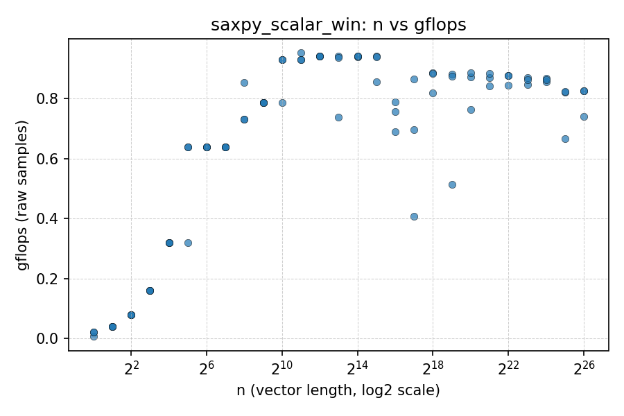

#### SIMD
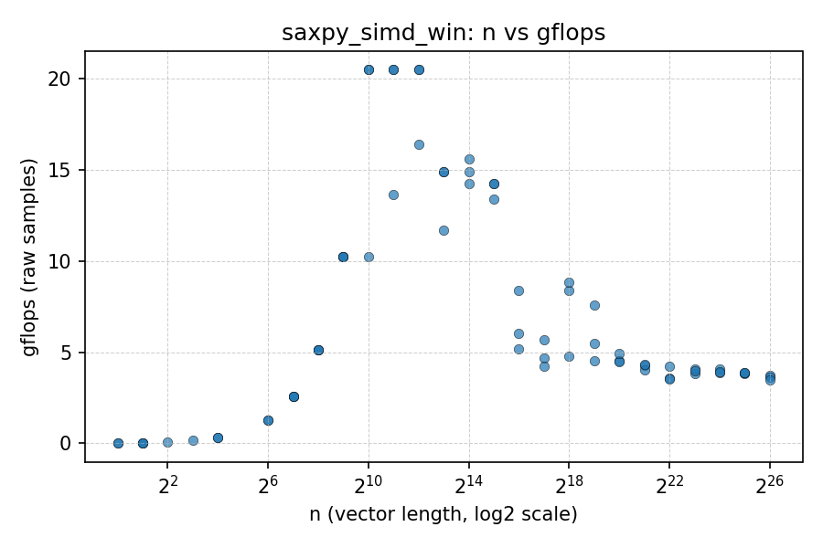

The SIMD version had significant improvments over the scalar version, reaching GFLOPs up to 20, compared to the maximum of 1 that was happening for the scalar version.

A pattern I see is that the GFLOPs go back down for the SIMD version, which doesn't happen for the scalar version. I believe this is due to the fact that the SIMD version is able to process more data in parallel, but as the data size increases, the overhead of managing the parallelism and memory access patterns can lead to diminishing returns. This is especially true if the data size exceeds the cache size, leading to more cache misses and slower memory access times.

This pattern is prevalent in many other benchmarks as well:
### SAXPY using float64
#### Scalar
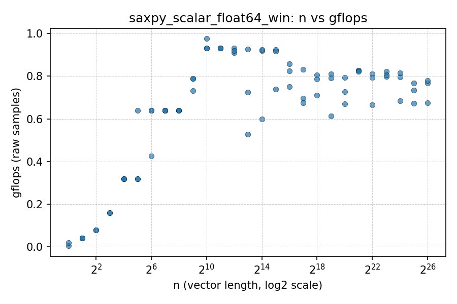

#### SIMD
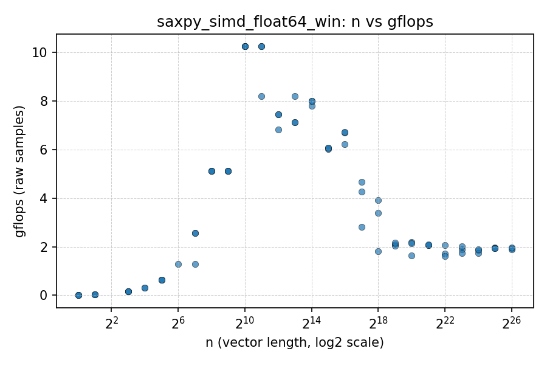

### SAXPY with unaligned vectors
#### Scalar
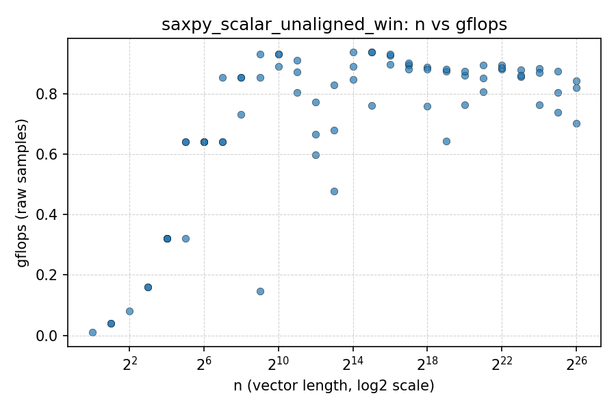

#### SIMD
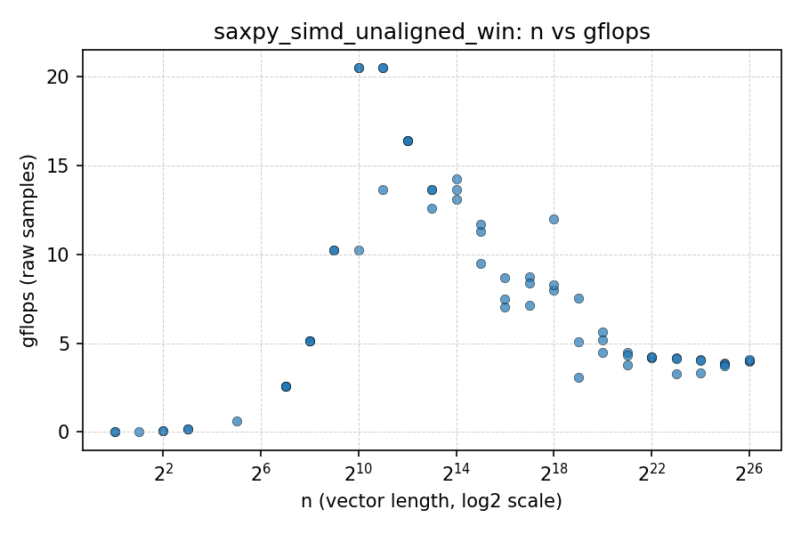

### SAXPY with stride of 2
#### Scalar
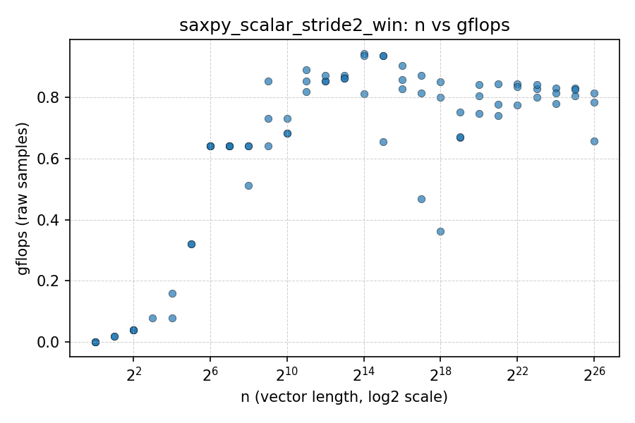

#### SIMD
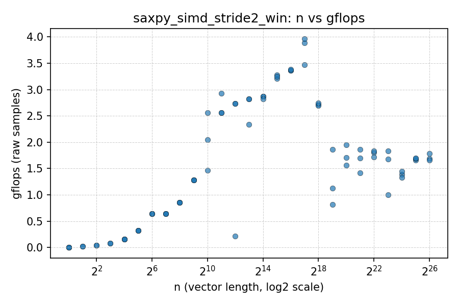

### Dot Product no modification
The results appeared to be very different when using my dot product implementation however. Both scalar and SIMD versions had very similar performance, with the SIMD version only slightly outperforming the scalar version. This could be due to several factors, including the specific implementation of the dot product algorithm, memory access patterns, or the overhead of setting up SIMD operations.

#### Scalar


#### SIMD
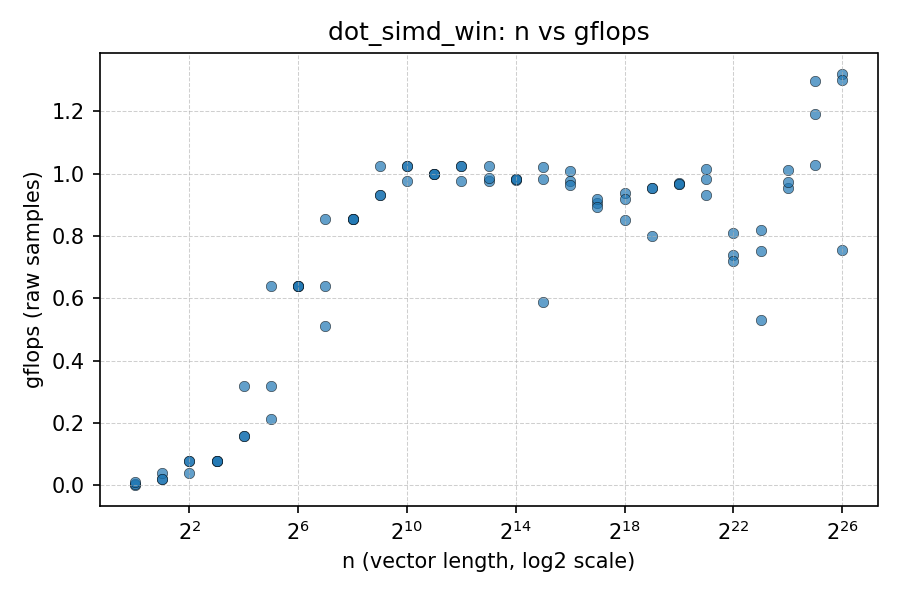

### Dot Product with float64
#### Scalar
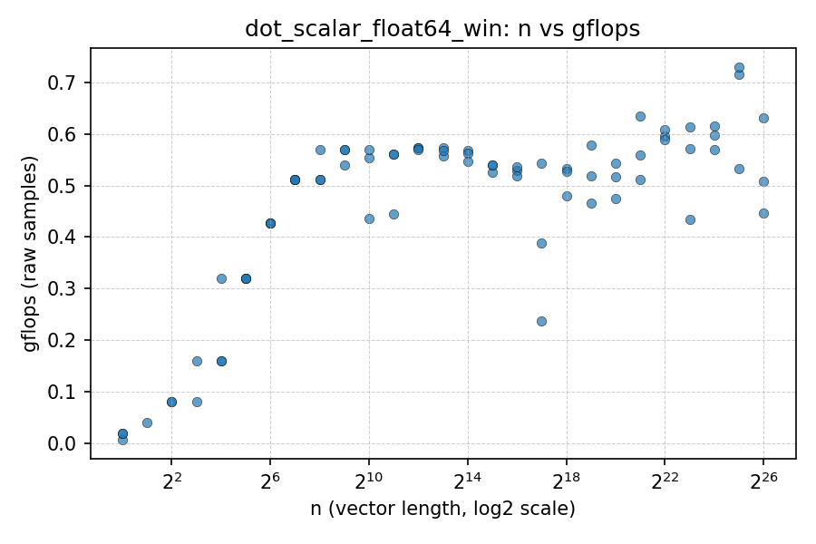

#### SIMD
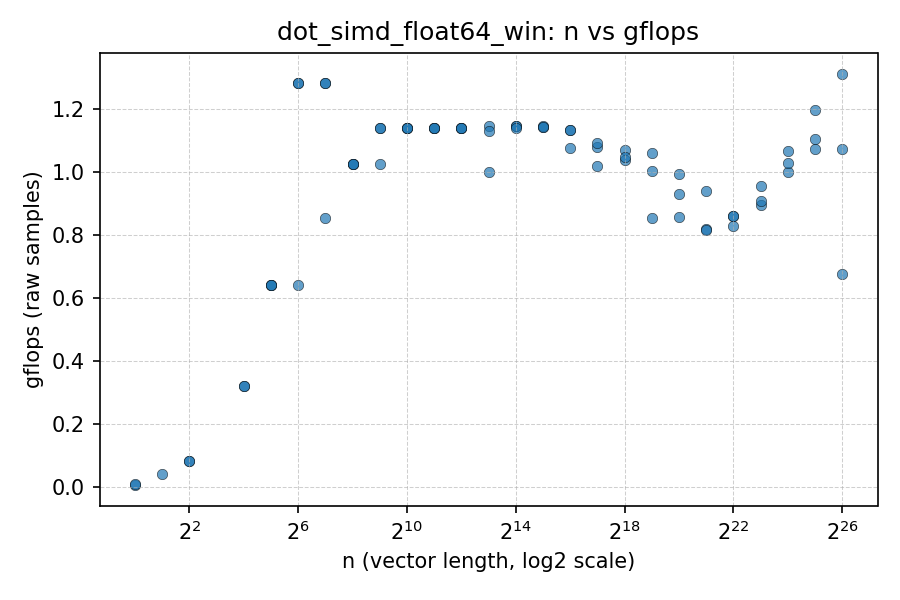

### Dot Product with unaligned vectors
#### Scalar
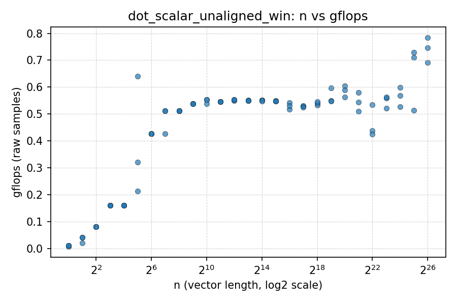

#### SIMD
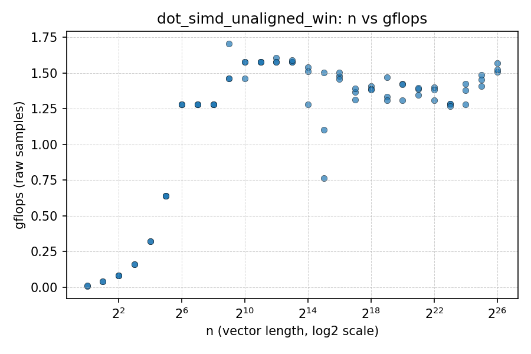

### Dot Product with stride of 2
#### Scalar
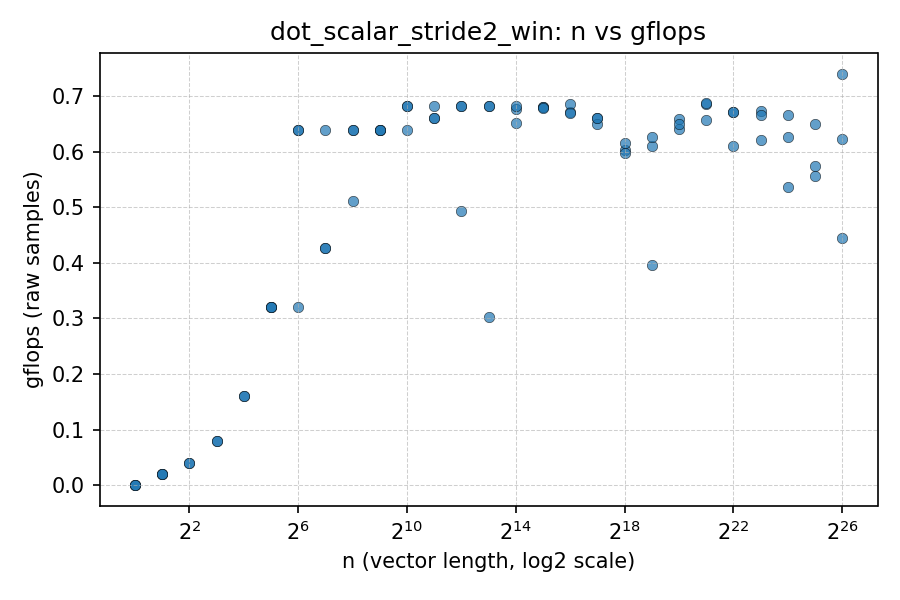

#### SIMD
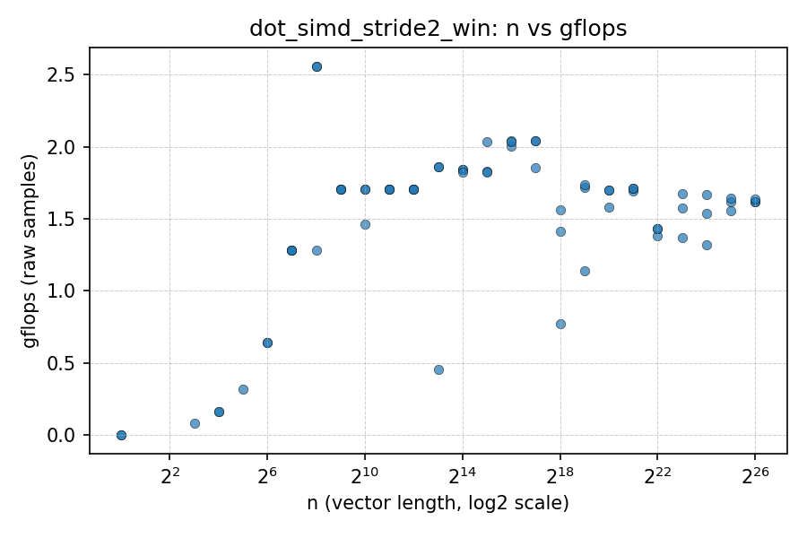

A lot more plots can be found in the `results` folder, including plots for the modified dot product implementations. Overall, the SIMD versions generally outperform the scalar versions, but the degree of improvement varies based on the specific implementation and data characteristics. Values for GFLOPs and time taken for each operation can be found in the CSV files in the `results` folder as well.