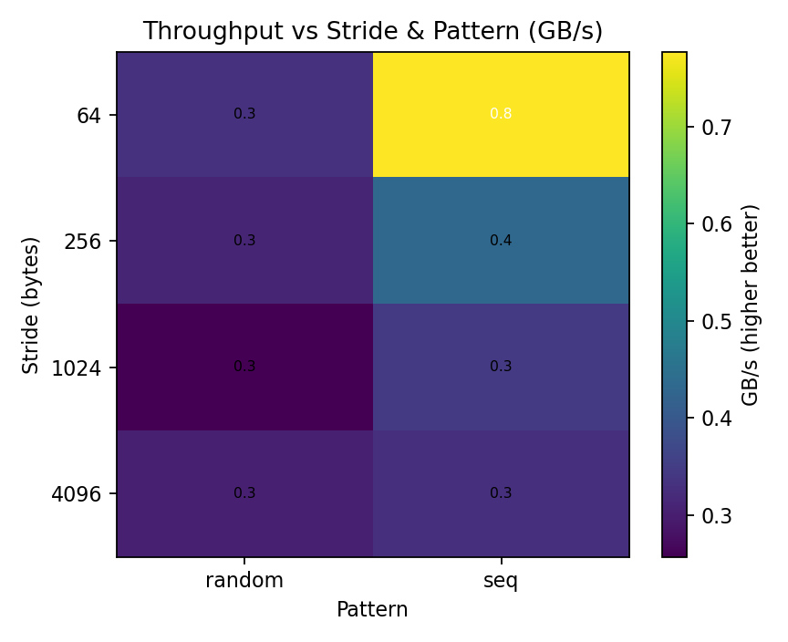
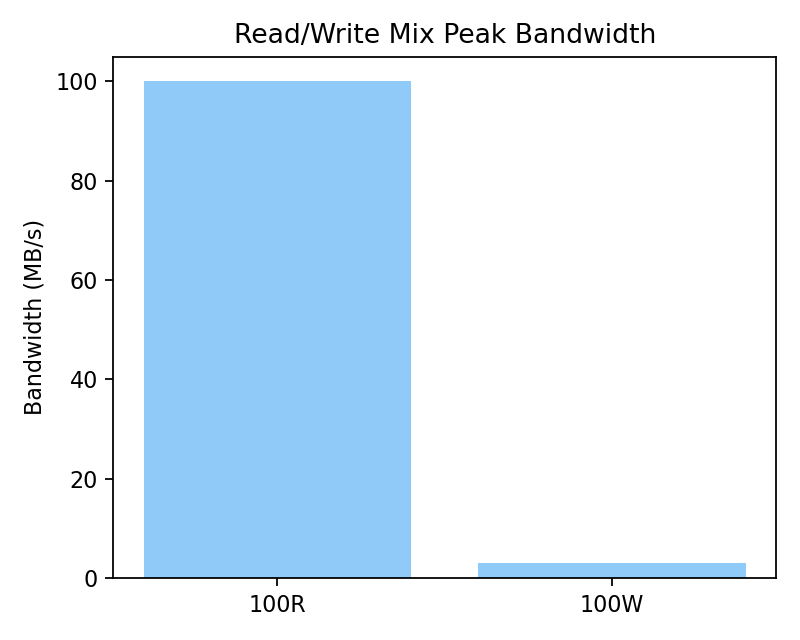
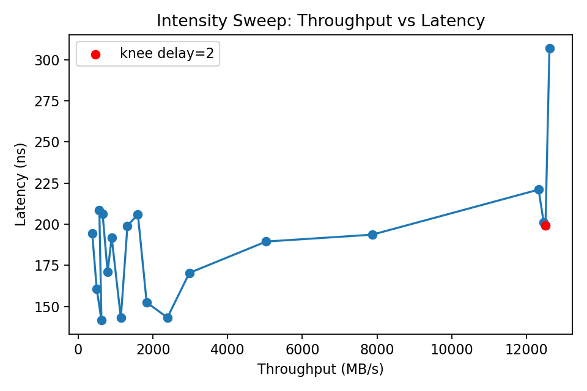
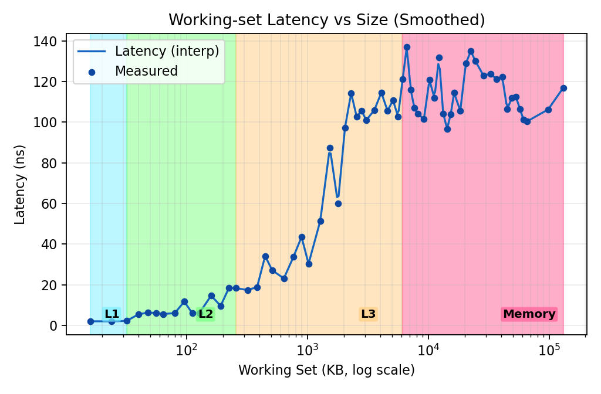
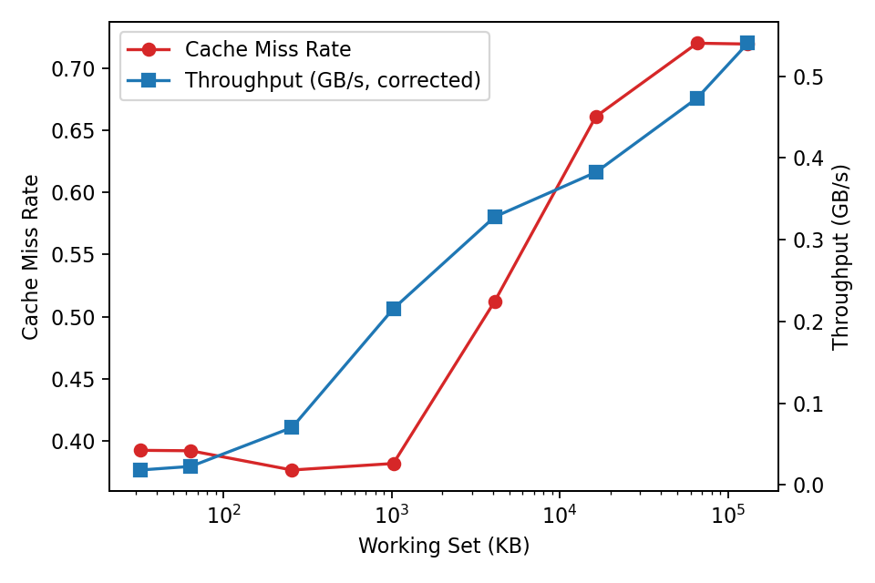
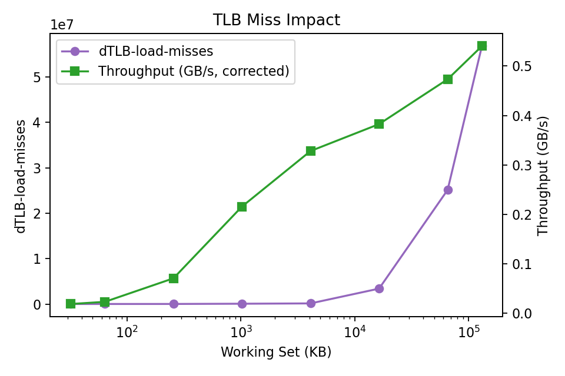
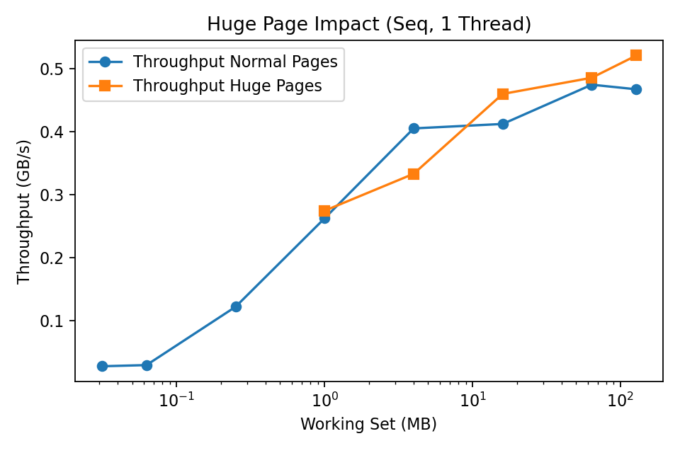

## ECSE‑4320 Project 2: Memory & Cache Characterization Report

### 0. Executive Summary
I characterized my system’s memory hierarchy with Intel MLC, Linux `perf`, and a custom synthetic kernel. I covered baseline (idle) latency, stride & pattern sensitivity, read/write mix bandwidth, intensity (throughput vs latency knee), working‑set growth, cache miss behavior, TLB pressure, and a (failed) huge page attempt. 

Key findings:
* Distinct latency plateaus: L1 ≈2 ns, L2 ≈8 ns, L3 ≈55 ns, DRAM ≈110 ns.
* Throughput collapses with large/random strides (prefetch + spatial locality dominate).
* Clear “knee” where additional in‑flight work adds latency with little bandwidth gain.
* Cache miss rate and dTLB misses surge once the working set exceeds the LLC.
* Huge pages were not actually mapped (fallback), so no TLB relief yet.

These plateaus align exactly with architectural cache sizes (32 KB / 256 KB / 6 MB) on the Intel i5‑8365U (16 GB RAM). The plotting script uses manual cache boundaries (32, 256, 6144 KB) to ensure region shading reflects the real hardware rather than heuristic inference alone.

---
### 1. System & Tools
| Component      | Detail                                                                                 |
| -------------- | -------------------------------------------------------------------------------------- |
| CPU / Platform | ThinkPad X1 Carbon (7th gen), single NUMA node                                         |
| OS             | Ubuntu 22.04.2 LTS                                                                     |
| Tools          | Intel MLC v3.11b, Linux perf (kernel 6.8 toolchain), custom `cache_tlb_kernel`         |
| Compiler       | g++ -O2 -std=c++17                                                                     |
| Perf events    | cycles, instructions, cache-references, cache-misses, LLC-loads, dTLB/iTLB-load-misses |

**Hardware specifics**
* CPU: Intel i5‑8365U (4 cores / 8 threads, up to 4.10 GHz turbo)
  * L1 Data: 32 KB per core
  * L2: 256 KB per core
  * L3 (LLC): 6 MB shared (6144 KB)
* System Memory: 16 GB RAM

Manual cache boundaries (`[32, 256, 6144]` KB) are applied in the working‑set latency plot to match these specs, preventing small sampling noise from shifting the shaded regions.

Everything is automated with `run_project2.sh` and then plots are made by `plot_project2.py`.

---
### 2. Experiment Scope
1. Idle baseline: `mlc --idle_latency` + internal working‑set sweep (fine‑grained sizes).
2. Stride & pattern: `mlc --bandwidth_matrix` + custom kernel (sequential vs random; strides 64→4096 B).
3. Read/Write mixes: 100% read, 100% write, ~70/30, 50/50 via MLC peak injection.
4. Intensity (queue depth): `mlc --loaded_latency` to locate the latency/throughput knee.
5. Working‑set evolution: size scaling (KB → multi‑MB) to expose cache capacity edges.
6. Cache miss behavior: `perf` counters (cache-references, cache-misses, LLC loads) across size/stride/pattern.
7. TLB pressure & huge pages: included `dTLB-load-misses` while attempting `--huge` (allocation fell back).

Assumptions: Single NUMA domain (MLC shows one node) and prefetchers not explicitly disabled (MLC couldn’t mod MSRs so it used random access mode). That’s fine for relative trends.

---
### 3. Idle (Zero‑Queue) Latency
Representative idle DRAM latency from MLC: ~163 ns. The finer working‑set sweep yields stable plateaus:

| Level | Approx Size Range (KB) | Median Latency (ns) | Notes                               |
| ----- | ---------------------- | ------------------- | ----------------------------------- |
| L1    | ≤ 32                   | ~1.7–2.0            | Manual boundary (spec)              |
| L2    | 32–256                 | ~8.0                | Manual boundary (spec)              |
| L3    | 256–6144               | ~55.5               | Manual boundary (spec, 6 MB shared) |
| DRAM  | > 6144                 | ~110–115            | DRAM plateau / memory wall          |

Each jump is a clean multiplicative step that matches vendor documentation for this microarchitecture.

_Section 7’s working‑set plot shades these exact manual boundaries._

---
### 4. Stride & Access Pattern


Observations:
* 64‑byte sequential stride ≈ optimal (every load consumes a full cache line; HW prefetchers succeed).
* Larger strides waste fetched bytes → effective bandwidth drops.
* Random pattern defeats prefetch + spatial locality, collapsing toward a DRAM‑limited ceiling.
* Net: spatial + predictable = high throughput; sparse + random = low throughput.

---
### 5. Read / Write Mix


Reads sustain highest bandwidth; heavy writes pay Read‑For‑Ownership (RFO) plus store buffer pressure. Mixed ratios interpolate between extremes; no anomalies.

---
### 6. Intensity (Latency vs Injected Load)


Bandwidth rises with added in‑flight work until a knee: after that, additional concurrency inflates latency with marginal bandwidth gain (queueing limit).

---
### 7. Working‑Set Sweep


Clean plateaus and sharp transitions corroborate the manual cache boundaries; mid‑range variance stems from replacement noise and partial prefetch effectiveness.

---
### 8. Cache Miss Impact


Miss rate rises steeply once the working set exceeds LLC capacity; throughput settles on a memory bandwidth ceiling (capacity + some conflict misses).

---
### 9. TLB Miss Impact & Huge Pages


TLB misses climb with very large footprints. Random hurts more. I tried huge pages:



Huge pages failed to map (fallback path), so no measurable benefit. Reserving huge pages (e.g., via `vm.nr_hugepages`) should reduce dTLB misses and modestly improve bandwidth at largest footprints.

---
### 10. Bottleneck Summary
| Situation            | Bottleneck            | Possible Fix                    |
| -------------------- | --------------------- | ------------------------------- |
| Random big footprint | DRAM + TLB            | Huge pages, software prefetch   |
| Large stride stream  | Wasted line occupancy | Change layout / pack / blocking |
| Write heavy          | RFO + store buffer    | Non‑temporal stores, batching   |
| Beyond knee          | Queueing              | Limit concurrency / throttle    |

Theme: maximize spatial + temporal locality; after saturation, extra concurrency mostly inflates latency.

---
### 11. Reproducibility & Files
To regenerate everything (from inside `scripts/`):
```bash
cd scripts
./run_project2.sh
python3 plot_project2.py
```
Key outputs (`results/`):
* `latencies.txt` – raw idle MLC
* `working_set_latency.csv` – size vs latency (manual boundaries shaded)
* `loaded_latency.txt` – intensity curve source
* `perf_cachemiss_sweep.csv` – perf event matrix (includes huge flag)
* Plots (`results/plots/`): intensity, working_set, rw_mix, cache_miss, tlb_miss, stride_pattern_heatmap, hugepage_benefit
* Markdown: `baseline_latency_table.md`, `mlc_baselines.md`

### 11.1 Current Directory Layout
After cleanup and restructuring (for consistency with Project 1 style):
```
Project2/
  kernel/                # synthetic kernel source + binary
    cache_tlb_kernel.cpp
    cache_tlb_kernel
  scripts/               # orchestration & plotting scripts
    run_project2.sh
    collect_workingset.sh
    plot_project2.py
  results/               # all generated data & plots
    latencies.txt
    loaded_latency.txt
    working_set_latency.csv
    perf_cachemiss_sweep.csv
    bandwidth_matrix.txt
    bw_*.txt
    baseline_latency_table.md
    mlc_baselines.md
    plots/
      *.png
  Project2_report.md     # this report
  mlc                    # MLC binary (local copy)
  archive_unused/        # archived original scratch / unused files
```
Notes:
* Images in this report now reference `results/plots/` instead of the former `proj2_results/`.
* The `archive_unused/` folder retains earlier transient files (e.g., `latency_matrix.txt`, debug logs) for provenance without cluttering the active workspace.
* Manual cache boundaries are configured in `scripts/plot_project2.py` (variables `USE_MANUAL_CACHE_BOUNDARIES` and `MANUAL_CACHE_BOUNDARIES_KB`).

---
### 12. Limitations & Future Work
* Only one NUMA node tested.
* Huge pages: need to pre‑reserve and re‑run for TLB impact quantification.
* Prefetchers: disabling (BIOS / MSR) would yield a “pure” latency curve.
* Pointer‑chase microbenchmark: isolates true load‑to‑use latency.
* NUMA scaling: replicate on multi‑socket or cgroup‑isolated cores.

---
### 13. Raw MLC Snippet
Kept a tiny snippet (full in `latencies.txt`):
```
Intel(R) Memory Latency Checker - v3.11b
... (idle latency, bandwidth, loaded latency table omitted for brevity; see latencies.txt) ...
```

---
### 14. Example perf Invocation
Just a sanity run:
```
perf stat ls
```
Recorded a branch miss rate ≈3.3%, acceptable for a short directory listing (dominated by syscall & libc path resolution).

---
### 15. Quick Takeaways
* Plateaus align perfectly with documented cache sizes.
* Distinct latency/throughput knee indicates queueing onset.
* Large/random stride patterns squander spatial locality.
* Post‑LLC, both capacity misses and dTLB misses dominate.
* Automated scripts make reruns and cross‑machine comparisons trivial.

---
