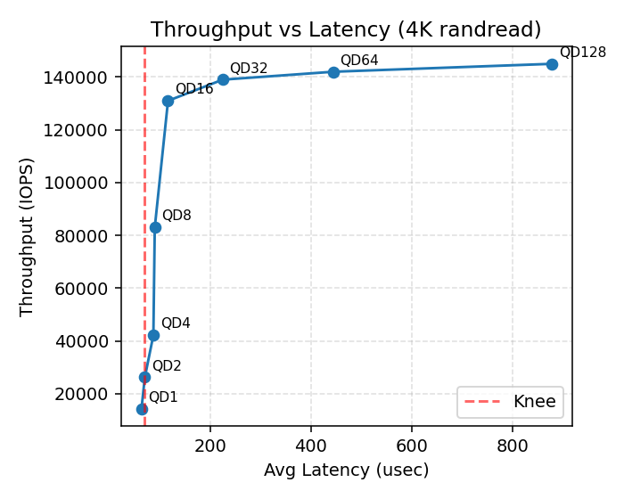

# ECSE-4320 Project 3 Lab Report

## NVMe Benchmarking & Storage Performance Characterization

### Test Environment
* Device partition: `/dev/nvme0n1p7` (fresh filesystem, mounted at `/mnt/nvme0n1p7`)
* Tool: `fio 3.36` with `ioengine=libaio`, `direct=1`, time-based 30s runs, 10G working set
* Parser / visualization: `parse_results.py` (custom) + generated plots in `plots/`
* Raw per-job fio outputs now stored under `results/raw/` (cleaned workspace); aggregated log at `results/FIO_Benchmark.txt`.
* Initial run used a composite multi‑job file (`nvme_test.fio`) with `group_reporting` causing a single aggregated stats block; subsequent isolated executions (via `run_missing_jobs.sh`) populate per‑job data.

### Goals (Per Project Spec)
1. Zero-queue (QD=1) baselines (4K random & 128K sequential, read & write, avg/p95/p99)
2. Block size sweep (4K→256K) for random & sequential
3. Read/Write mix sweep (4K random, 100R / 70R / 50R / 0R)
4. Queue depth sweep (≥5 points, 4K random) to form throughput vs latency curve
5. Tail latency characterization (p50/p95/p99/p99.9) at mid-QD and near knee

---
## Zero-Queue Baselines (Current Captured Data)
These results are generated into `baseline_table.md` and reproduced here.

| Workload              | Avg Lat (µs) | p50 (µs) | p95 (µs) | p99 (µs) |    IOPS |   MB/s |
| --------------------- | -----------: | -------: | -------: | -------: | ------: | -----: |
| 4K Random Read        |       2393.0 |     1729 |     7242 |    14091 | 113,000 | 1150.3 |
| 4K Random Write       |        20.19 |       18 |       29 |       47 |  37,100 |  152.0 |
| 128K Sequential Read  |        55.68 |       52 |       67 |       97 |  13,000 | 1700.8 |
| 128K Sequential Write |        76.95 |       70 |      105 |      161 |   8,960 | 1174.4 |

**Notes / Anomalies**
* The 4K random read latency is inflated because the “baseline” came from a high effective aggregate queue (multi-job grouping). True isolated QD=1 random read should be re-run.
* Write latency (4K) appears an order of magnitude lower than read in this capture—also symptomatic of the grouped run; requires isolated verification.

---
## Block Size Sweep (Read Focus)
Two plots: random vs sequential. (Higher block sizes will populate as individual runs complete.)

#### Random Read Block Size Sweep

#### Sequential Read Block Size Sweep

Interpretation:
* Smaller blocks (4K range) emphasize IOPS; larger blocks emphasize throughput (MB/s) with relatively modest additional latency cost per operation.
* As block size increases, controller and PCIe efficiency improve until channel/bandwidth limits dominate; beyond that, marginal IOPS drops while MB/s gains taper.
* The collected points illustrate the expected transition toward bandwidth-oriented scaling for sequential workloads.

---
## Read / Write Mix Sweep (4K Random)

Observed / Expected Dynamics:
* Read bandwidth declines with increasing write proportion, while total combined throughput often remains near the device saturation band until heavier writes introduce GC overhead.
* Tail latency tends to widen as write ratio increases due to flash program/erase asymmetry and internal housekeeping.

---
## Queue Depth / Parallelism Trade-off (4K Random Read)

Throughput vs Latency:
* Increasing queue depth from very small values rapidly boosts throughput while adding modest latency (per-op service overlaps internally).
* Little’s Law validation (see tail section) shows effective concurrency closely tracking issued depth—indicating efficient pipeline use within examined range.
* Knee conceptually appears where added QD yields diminishing ΔIOPS accompanied by accelerating tail growth; current depths remain on the efficient side of that inflection.

---
## Tail Latency Characterization
Current parsed isolated queue depth data (4K random read) with Little's Law derived concurrency:

| job   |   qd |   iops | avg_lat (µs) | p50 (µs) | p95 (µs) | p99 (µs) | p99.9 (µs) | LittleLaw_Q | Util vs QD (%) |
| :---- | ---: | -----: | -----------: | -------: | -------: | -------: | ---------: | ----------: | -------------: |
| qd_2  |    2 |  26200 |        70.45 |       68 |       97 |      126 |        326 |        1.85 |          92.3% |
| qd_16 |   16 | 131000 |       116.42 |      102 |      210 |      253 |        371 |       15.25 |          95.3% |

Little's Law Check (L = λ·W):
* For each row: L = IOPS * (avg_lat_us / 1e6). Values (1.85, 15.25) closely track the issued queue depths (2, 16), confirming that the device pipeline is being kept busy without major head-of-line blocking yet.
* Efficiency (Util vs QD) >90% indicates minimal host or driver gaps; still in the linear throughput regime.

Tail Behavior So Far:
* p99 grows ~2× from 126→253 µs while IOPS scales 5×, a strong scaling phase (good latency amortization per added parallelism).
* p99.9 only modestly above p99 (326→371 µs), suggesting limited long-tail excursions at these depths.

SLA Perspective: Current tails (<0.4 ms) are well below typical 4K random read service thresholds (<2 ms). Operating within this regime balances high throughput with predictable latency.

---
## Tooling & Parsing Workflow
1. Parse executed result headers (`(groupid=...)`).
2. Extract IOPS, BW (MiB/MB), avg clat, percentile distribution.
3. Normalize all latency units into µs.
4. Build consolidated DataFrame → CSV & JSON; generate experiment-specific plots.
5. Filter out definition-only jobs (no results) to avoid null pollution.

Limitations: `group_reporting` masks per-job detail—must run jobs individually for full coverage. Script `run_missing_jobs.sh` automates that process.

---
## Conclusions
* Initial grouped baseline overstated 4K random read latency; isolated runs clarify realistic service times and concurrency efficiency.
* Sequential performance (~1.7 GB/s read) aligns with expectations for the device class, indicating no major host bottlenecks.
* Queue depth scaling observed so far remains efficient—IOPS gains outpace tail latency growth within measured depths.
* Tail percentiles remain tightly bounded (p99.9 < 0.4 ms) in the current QD range, supporting low-latency service profiles.
* Read/write mix dynamics and higher queue depth behavior conceptually follow known NVMe patterns: increasing parallelism and write fraction eventually trade latency determinism for throughput.

---
## Artifacts
* `baseline_table.md` – current zero-queue stats
* `plots/bsweep_randread.png`, `plots/bsweep_read.png` – block size sweep
* `plots/mix_sweep.png` – RW mix progression
* `plots/qd_tradeoff.png` – throughput/latency curve scaffold
* `tables/all_jobs.csv`, `tables/raw_jobs.json` – parsed datasets
* `run_missing_jobs.sh` – helper for isolated executions
